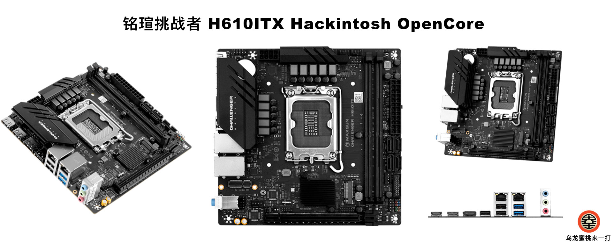

## 铭瑄-挑战者 H610ITX 黑苹果 OpenCore EFI



### OpenCore

[OpenCore 1.0.3](https://github.com/acidanthera/OpenCorePkg)

### macOS

- macOS Monterey 12.x
- macOS Ventura  13.x 
- macOS Sonoma 14.x
- macOS Sonoma 15.x

### 硬件

- 芯片组: H610
- Bios 版本: 5.24（08/15/2022）
- 处理器: 英特尔12代 i3 -12100F
- 内    存: 16G*2 DDR4 3200MHz
- 硬    盘: KingBank KP260 1TB MacOS
- 硬    盘: KingBank KP260 1TB Windows
- 独    显: PowerColor AMD Radeon RX6650XT DDR6 8GB
- 声    卡: 瑞昱 ALC897
- 有线网卡: 瑞昱 8125 2.5GbE
- 无线网卡: 白果拆机bcm94360cs2+转接板

### BIOS设置

```

|-- VT-d：开启 （如启动出现灰屏或白屏请禁用此选项）
|-- Above 4G decoding：开启
|-- Resizable Bar：关闭
|-- EHCI/XHCI Hand-off：开启
|-- CSM Support：关闭
|-- Fast Boot：关闭
|-- Secure Boot：关闭
|-- CFG LOCK：关闭

```

### 注意事项

 - 安装成功后必须使用 [OCAuxiliaryTools](https://github.com/ic005k/OCAuxiliaryTools) 生成你自己的 SMBIOS

### 参考内容

[1.黑苹果安装过程演示](https://hackintosh.club/d/10000060)

[2.英特尔无线网卡WiFi驱动](https://hackintosh.club/d/10000015)

[3.英特尔无线网卡蓝牙驱动](https://hackintosh.club/d/10000017)

[4.我的B站黑苹果教程](https://space.bilibili.com/244390800/video)

[6.黑果之家](https://hackintosh.club)

### 联系我们

QQ群: 23304408


### 常用工具

- [Hackintool](https://github.com/headkaze/Hackintool) 
- [OCAuxiliaryTools](https://github.com/ic005k/OCAuxiliaryTools) AKA `OCAT`.
- [OpenCore Configurator](https://mackie100projects.altervista.org/opencore-configurator/) AKA `OCC`.
- [gibMacOS](https://github.com/corpnewt/gibMacOS) Build your own MacOS image.
- [ProperTree](https://github.com/corpnewt/ProperTree) Plist editor.